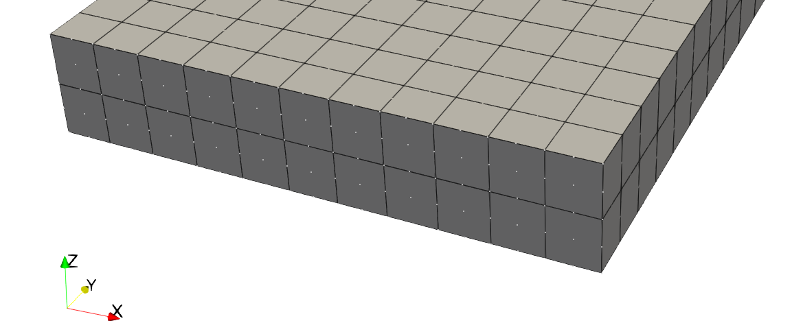
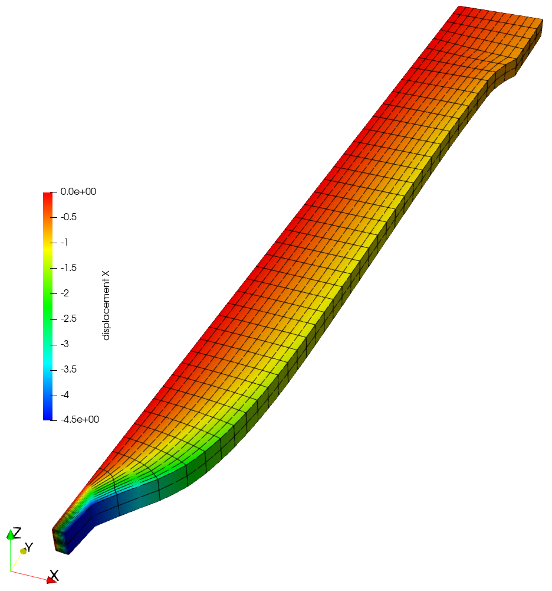
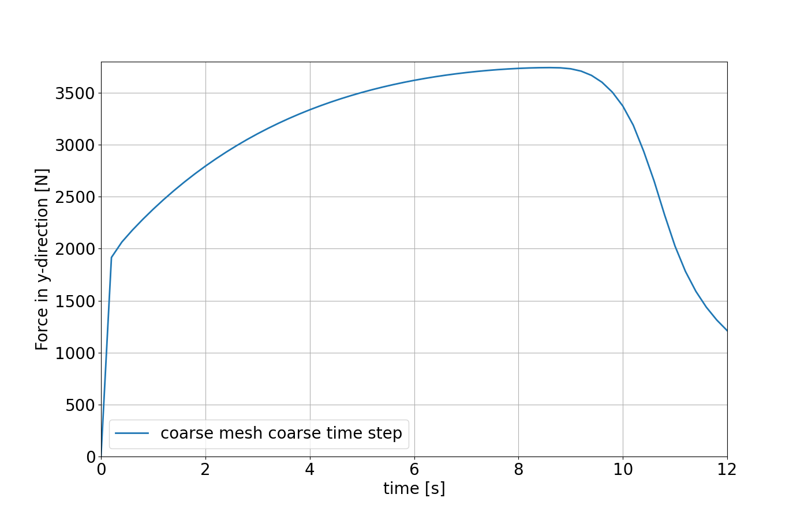
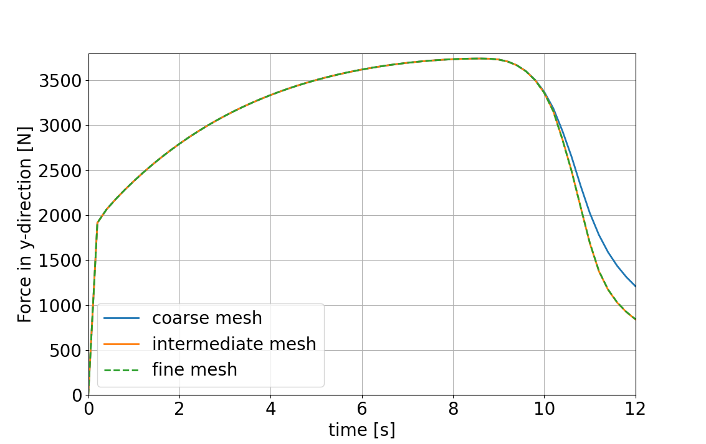
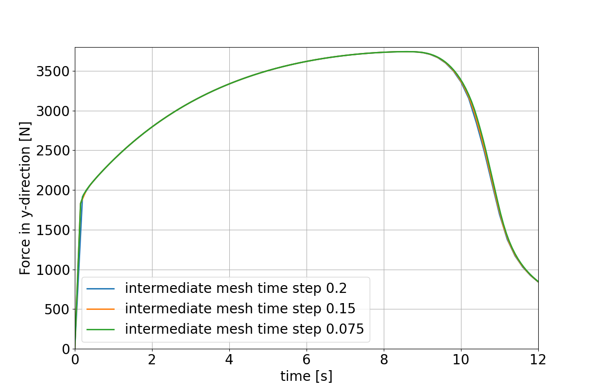

# Introduction to solid mechanics in 4C

A simple tensile test scenario is investigated as an introductory example for using solid mechanics within **4C**.

## Prerequisites

All prerequisites are met for the UKACM GACM workshop by setting up the provided virtual machine.

## Introduction

The analyzed structure is a simple tensile bar, which can be used to identify the material’s parameters by comparing the stress-strain curve of the simulation with the respective experiment. Instead of the stress-strain curve, we will compare the reaction force over time for a given constant displacement rate to ease the analysis. The geometry is shown in the following figure

|  |
| :--: |
| *Geometrical setup of the tensile test.* |

with the measures as listed in the table below

| Quantity | Length in (mm) |
| --- | --- |
| $`l_1`$ | 65.0 |
| $`l_2`$ | 50.0 |
| $`w_1`$ | 11.34 |
| $`w_2`$ | 10.0 |
| $`t`$ | 2.0 |

The material under consideration is an Aluminum alloy with a yield strength of 330 MPa and mild isotropic hardening. During the test, the sample is elongated in the $`y`$-direction and the resulting reaction force is measured.

## Preprocessing

Due to the symmetry of the problem setup, we may restrict our analysis to one half in the length direction (the $`y`$-direction of the coordinate system). In addition, symmetry in the width direction (the $`x`$-direction of the coordinate system) and thickness direction (the $`z`$-direction of the coordinate system) can be exploited to reduce the investigated size of the model to one eighth of its original size. The resulting geometry is discretized with hexahedral elements with quadratic shape functions (`HEX27`). In this tutorial, three meshes with different levels of mesh refinement are provided to investigate the spatial convergence of the results. They are provided in the Exodus II file format following the name pattern: `tutorial_solid_rect_mesh_<Name>.e`, where `<Name>` needs to be substituted by the names given in the table below. The table presents properties of the different meshes

| Name | Number of elements | Number of nodes |
| --- | --- | --- |
| coarse | 330 | 3375 |
| intermediate | 1400 | 13203 |
| fine | 3744 | 33259 |

The mesh of the fine discretization used in this tutorial is shown in the figure below.

|  |
| :--: |
| *Mesh including symmetry assumptions to reduce the model size. Furthermore, the symmetry and displacement boundary conditions are visualized.* |

Symmetry boundary conditions are applied to the three symmetry planes, denoted with $`\text{X}_\text{symm}`$, $`\text{Y}_\text{symm}`$, and $`\text{Z}_\text{symm}`$ in the figure above. The top surface (`Top`) is subject to a Dirichlet boundary condition with linearly increasing displacement in the positive $`y`$-direction, as displayed in the figure.

## Working with 4C

### Creation of a valid 4C input file

To simulate the described problem using **4C**, we need to create a valid **4C** input file. A valid template input file for this problem is already provided with the file `tutorial_solid_rect.4C.yaml`. In the following, we will briefly walk you through the main settings defined in this input file.

> **Hint** Use VS Code to open the **4C** input files. VS Code is set up to use the JSON Schema file (`4C_schema.json`) provided by **4C**. This can be very helpful as it enables to display the documentation of the parameters, allows for auto completion, and shows the different options that can be set.  
> The file ending of the 4C input files is `.4C.yaml`.

> **Hint** The documentation of the [input parameters](https://4c-multiphysics.github.io/4C/documentation/input_parameter_reference/parameterreference.html#input-parameter-reference) can also be very helpful to adapt the input files.

The template input file begins with the following lines

```yaml
PROBLEM TYPE:
  PROBLEMTYPE: Structure
PROBLEM SIZE:
  DIM: 3
STRUCTURE GEOMETRY:
  FILE: tutorial_solid_rect_mesh_coarse.e
  SHOW_INFO: detailed_summary
  ELEMENT_BLOCKS:
    - ID: 1
      SOLID:
        HEX27:
          MAT: 1
          KINEM: nonlinear
```

in which it is defined that a solid mechanics problem shall be solved (`PROBLEMTYPE: Structure`) in a three-dimensional setting (`DIM: 3`). The last block (`STRUCTURE GEOMETRY`) defines how the discretized geometry is provided to the code. It is defined that the mesh shall be read from the file `tutorial_solid_rect_mesh_coarse.e`, which consists of one block of elements, i.e., all elements that define the geometry shown above. It is further specified that hexahedral elements with quadratic shape functions are used (`HEX27`), the material with ID 1 is assigned to those elements (`MAT: 1`), and nonlinear kinematics employing the Green--Lagrange strains are used for the calculations (`KINEM: nonlinear`).

Moreover, settings for the solid solver need to be set. This is accomplished with the following lines within the input file

```yaml
STRUCTURAL DYNAMIC:
  INT_STRATEGY: Standard
  DYNAMICTYPE: Statics
  TIMESTEP: 0.2
  RESTARTEVERY: 60
  NUMSTEP: 60
  MAXTIME: 12.0
  TOLDISP: 1.0e-4
  TOLRES: 1.0e-4
  NORM_RESF: Rel
  PREDICT: TangDis
  LINEAR_SOLVER: 1
```

Here, the time integration scheme is set to statics, as we investigate a quasi-static problem setup (`DYNAMICTYPE: Statics`). Furthermore, the base simulation settings consist of 60 time steps spanning from $`t_0=0`$ s to $`t_1=12`$ s (`MAXTIME`) with a time step size of $`\Delta t=0.2`$ s (`TIMESTEP`). Moreover, the tolerance for the 2-norm of the residual (`TOLRES`) and the 2-norm of the displacement increments (`TOLDISP`) is set. Finally, the linear solver is chosen as the solver with ID 1. The solver will be defined later in the file by specifying `SOLVER 1`.

The next block of input file lines defines how often and what kind of output is written to visualize the results of the simulations.

```yaml
IO:
  STRUCT_STRESS: Cauchy
  STRUCT_STRAIN: GL
IO/RUNTIME VTK OUTPUT:
  INTERVAL_STEPS: 1
IO/RUNTIME VTK OUTPUT/STRUCTURE:
  OUTPUT_STRUCTURE: true
  DISPLACEMENT: true
  STRESS_STRAIN: true
IO/MONITOR STRUCTURE DBC:
  INTERVAL_STEPS: 1
```

First, it is defined that the stress output should be Cauchy stresses (`STRUCT_STRESS: Cauchy`) and the strain output should be Green-Lagrange strains (`STRUCT_STRAIN: GL`), while `INTERVAL_STEPS: 1` describes the output frequency, i.e., that output in every time step should be performed. Moreover, the settings in `IO/RUNTIME VTK OUTPUT/STRUCTURE` activate the output of the solid mechanics solution and define that the displacement field, the stresses, and the strains should be written to output.

The next aspect to be defined is the material definition, which is chosen as follows

```yaml
MATERIALS:
  - MAT: 1
    MAT_Struct_PlasticNlnLogNeoHooke:
      YOUNG: 70.0e3
      NUE: 0.33
      DENS: 1
      YIELD: 330
      SATHARDENING: 1000
      HARDEXPO: 5
      VISC: 0.01
      RATE_DEPENDENCY: 1
```

Only the material with material ID 1 has been referenced above in the definition of the underlying mesh for the simulation. Thus, only one material needs to be defined which is called `MAT_Struct_PlasticNlnLogNeoHooke`. It is a plasticity model that uses the von Mises yield criterion

```math
\Phi = \tilde{\mathbf{\tau}} - \sqrt{\frac{2}{3}} \sigma_Y
```

with $`\tilde{\mathbf{\tau}}`$ being the deviatoric Kirchhoff stress. Additionally, a compressible Neo-Hooke elasticity model is expressed by the free energy. The potential

```math
\rho_0 \Psi(\mathbf{B}^e) =  \frac{K}{2} \left[ \frac{1}{2} (J^2 - 1) - \ln J \right] + \frac{1}{2} \mu \left[ \text{tr} \mathbf{\tilde{B}}^e - 3 \right]
```

Here, $`J`$ is the determinant of the deformation gradient $`\mathbf{F}`$, $`\mathbf{B}^e = \mathbf{F}^e {\mathbf{F}^e}^T`$ is the elastic part of the left Cauchy-Green tensor, and $`K, \mu`$ are elastic constants. Plasticity with isotropic hardening is assumed

```math
\sigma_Y = \sigma_{Y,0} + (\sigma_{Y,\infty} - \sigma_{Y_0}) \left[ 1 - \exp \left( - k \, \varepsilon_p \right) \right]
```

with $`\sigma_{Y,0}=330, \sigma_{Y,\infty} = 1000, k=5`$. Moreover, a Young's modulus of 70.0e3 and a Poisson's ratio of 0.33 is prescribed. Please note, as we are investigating a quasi-static simulation scenario and the time integration `Statics` is used, dynamic effects and thus the density of the material do not have an effect. It is thus set to an arbitrary value of 1 in this case.

Furthermore, two linear solvers are defined in the template as follows

```yaml
SOLVER 1:
  SOLVER: Superlu
  NAME: direct_solver
SOLVER 2:
  SOLVER: Belos
  SOLVER_XML_FILE: iterative_gmres_template.xml
  AZPREC: MueLu
  MUELU_XML_FILE: elasticity_template.xml
  NAME: iterative_solver
```

The `SOLVER 1` is the direct solver `Superlu`. In addition, an iterative solver, that usually outperforms direct solvers especially for larger systems, is defined as `SOLVER 2`. However, a proper setup of an iterative solver is more intricate than just defining a direct solver. If you want more information on iterative solvers, please refer to the [respective tutorial](https://4c-multiphysics.github.io/4C/documentation/tutorials/tutorial_preconditioning.html#).

At this stage, everything besides the boundary conditions is defined. This is done using the following lines of the input file

```yaml
DESIGN SURF DIRICH CONDITIONS:
  - E: 1
    NUMDOF: 3
    ENTITY_TYPE: node_set_id
    ONOFF: [0, 1, 0]
    VAL: [0, 0, 0]
    FUNCT: [0, 0, 0]
  - E: 2
    NUMDOF: 3
    ENTITY_TYPE: node_set_id
    ONOFF: [0, 0, 1]
    VAL: [0, 0, 0]
    FUNCT: [0, 0, 0]
  - E: 3
    NUMDOF: 3
    ENTITY_TYPE: node_set_id
    ONOFF: [1, 0, 0]
    VAL: [0, 0, 0]
    FUNCT: [0, 0, 0]
  - E: 4
    NUMDOF: 3
    ENTITY_TYPE: node_set_id
    ONOFF: [0, 1, 0]
    VAL: [0, 1, 0]
    FUNCT: [0, 1, 0]
    TAG: monitor_reaction
FUNCT1:
  - SYMBOLIC_FUNCTION_OF_SPACE_TIME: t
```

We briefly describe the definition of the Dirichlet boundary conditions (DBC) applied to the system. The name `DESIGN SURF DIRICH CONDITIONS` already describes that the DBC is applied to the surfaces of the geometry. The component `NUMDOF: 3` defines that there are three degrees of freedom (DOF) per node. Moreover, the component `ONOFF` is a list of values (one for each DOF) that defines whether the DBC is activated for this DOF (1) or not (0). The component `VAL` defines what value is prescribed for the respective DOF. In addition, a functional expression can be prescribed via `FUNCT`. In this case, the prescribed value is calculated based on a multiplication of the evaluated function and the respective constant value in `VAL`. Moreover, for the last DBC, the parameter `TAG: monitor_reaction` is set, which results in tracking the reaction force at that surface.

In the above section, four DBCs are defined. The following table lists which entity ID (`E`) belongs to which surface defined in the mesh, as displayed in the picture above

| Entity ID (`E`) | Surface |
| --- | --- |
| 1 | $`\text{Y}_\text{symm}`$ |
| 2 | $`\text{Z}_\text{symm}`$ |
| 3 | $`\text{X}_\text{symm}`$ |
| 4 | Top |

So for the DBC applied to the nodes of the `Top` surface the following values are prescribed in positive $`y`$-direction

$`1*t`$

originating from the components of (`VAL`*`FUNCT1`).

> **Hint**
> If you want to have a visual impression of what DBC is assigned to which surface of the problem, you can use ParaView. To do so, open the respective Exodus file in ParaView by: `File->Open->Navigate to the desired *.e file and open it`.  
> When activating the checkmark for the node set to be visualized in the Properties tab, the nodes of the selected node set are displayed in RenderView. The available node sets in the provided geometry files are: `xsymm, ysymm, zsymm, and top`.

|  |
| :--: |
| *Nodes that are part of the node set of the `ysymm` surface visualized by green spheres in ParaView.* |

### Execute a 4C simulation

Now that the input file for **4C** has been created and discussed, the simulation can be started. For execution on a single processor, the simulation is started by the following command

```bash
<path-to-build-dir>/4C <path-to-input-file-dir>/tutorial_solid_rect.4C.yaml <path-to-output-file-dir>/tutorial_solid_rect
```

So first, the location of the executable **4C** needs to be given. Then, the location of the input file and the desired location of the output files need to be specified. Please note that the `<path-to-input-file-dir>/` and the `<path-to-output-file-dir>/` can be empty. In this case, the input file must be in your current working directory, and the output files will be generated in the same directory.

For parallel execution of the simulation using several processes, use

```bash
mpirun -np <n_cpu> <path-to-build-dir>/4C <path-to-input-file-dir>/tutorial_solid_rect.4C.yaml <path-to-output-file-dir>/tutorial_solid_rect
```

meaning that the command `mpirun -np <n_cpu>` has to be prepended to the original command to specify the number of processors (`n_cpu`) that should be used.

> **Hint**
> The screen output during the solution process is rather long but might contain relevant information. So you can store it in a separate file. To do so, append `|tee <path-to-output-file-dir>/tutorial_solid_rect.txt` to the aforementioned commands to store the screen output to the defined txt-file.

### Post processing

The results are written in `VTK` format as defined in the input file. You will find the following file and directory structure in the output directory (`<path-to-output-file-dir>`) defined for the execution of **4C**:
- `tutorial_solid_rect.pvd`: This ParaView Data file contains the information on where the actual VTK data is stored. When used with e.g. ParaView, only this file needs to be opened to load the complete simulation output data for visualization.
- `tutorial_solid_rect-vtk-files`: This is the directory containing the actual output files. Two different file types are created:
  - `*.pvtu`: For each time step, one `pvtu` file is created that contains the link to the `vtu` files of each processor that was included in the calculation
  - `*.vtu`: Every processor writes the processor-local output data to a specific file, the so-called `vtu` file for each time step. This is the file that contains the actual data.

When opening the result data with e.g. ParaView, the following steps are necessary:

1. File &rarr; Open &rarr; Navigate to your output folder and choose the `pvd`-file.
1. The filter `Warp By Vector` needs to be applied to display the specimen in the deformed configuration. Filters &rarr; Alphabetical &rarr; Warp By Vector
1. Different quantities like the displacement field can be chosen from a dropdown menu, and further filters, e.g., to extract specific parts of the complete specimen, or plot certain quantities, can be applied.

As an example the figure below shows the displacement in $`x`$-direction at the last simulated time step for the mesh with the finest mesh resolution.

|  |
| :--: |
| *Deformed mesh at the last time step with contours of the displacement in $`x`$-direction.* |

Furthermore, a csv file containing the reaction force of the DBC assigned to the `Top` surface is written. For visualizing the reaction force over time ,e.g., a simple python script can be used to obtain:

|  |
| :--: |
| *Reaction force of the DBC assigned to the `Top` surface plotted over time.* |

Such a python script can be composed of the following commands:
```python
import pandas as pd
import matplotlib.pyplot as plt

# define columns to load from the csv file
columns = ["time", "f:1"]

# load the data
coarse = pd.read_csv(
    "/path/to/csv/file/tutorial_solid_rect-10005_monitor_dbc.csv",
    usecols=columns,
)
# replace one column name as 'f:1' is not accepted for plotting
coarse = coarse.rename(columns={"f:1": "f_y"})

# add the data to the plot
plt.plot(coarse.time, coarse.f_y)

# create the plot
plt.xlabel("time [s]")
plt.ylabel("Force in y-direction [N]")
plt.show()
```

## Numerical analyses

### Step 1
We first want to analyze the influence of the chosen solver. In the template **4C** input file two solvers have been prepared
1. `SOLVER 1`: direct solver
1. `SOLVER 2`: iterative solver

First, the influence of the solvers on the runtime of the simulations is compared to decide which solver should be used for the subsequent simulations. Please note, that this is also dependent on what mesh is used.

> **Hint:** Make sure to choose reasonable names as the simulation output name. Also consider to structure your output data using different directories.

> **Hint:** Different meshes result in a different number of degrees of freedom. Thus, it is also recommended to use a different number of processors. The reference results have been produced with
>| Name | Number of processors |
>| --- | --- | 
>| coarse | 2 | 
>| intermediate | 4 |
>| fine | 8 |
> Also avoid using the direct solver for the fine mesh as the runtime will be too long.

<details>
<summary>Solution</summary>

To change the used solver from the direct solver to the iterative solver only the definition of the `LINEAR_SOLVER` in the `STRUCTURAL DYNAMIC` section needs to be changed from `1` to `2`, see below

```yaml
STRUCTURAL DYNAMIC:
  LINEAR_SOLVER: 2
```

To change the mesh used in the simulation, only the filename of the parameter `FILE` in the section `STRUCTURE GEOMETRY` needs to be changed. The available meshes are: `tutorial_solid_rect_mesh_coarse.e`, `tutorial_solid_rect_mesh_intermediate.e`, and `tutorial_solid_rect_mesh_fine.e`.

```yaml
STRUCTURE GEOMETRY:
  FILE: tutorial_solid_rect_mesh_intermediate.e
```

When analyzing the runtimes of the simulations for the direct solver and the iterative solver for the different meshes you can, e.g., compare the screen output `Total wall time for CALCULATION:  xxx sec` of each simulation.

> **Result** The simulations with the iterative solver are faster for the `intermediate` and `fine` meshes and comparable for the `coarse` mesh. Thus, the following simulations should be performed with the `iterative solver (SOLVER 2)`.

</details>


### Step 2
Now, it should be evaluated whether the numerical results are temporally and spatially converged w.r.t. the progression of the reaction force at the DBC over time.

### Step 2.1
For the analysis if spatial convergence w.r.t. the progression of the reaction force at the DBC over time is already achieved, three different meshes have been prepared as outlined above.

Since for **Step 1** simulations with all meshes have already been performed, the results of these simulation can just be evaluated, e.g., based on the Python commands presented in the section [post processing](#post-processing).

<details>
<summary>Solution</summary>

|  |
| :--: |
| *Reaction force of the DBC assigned to the `Top` surface plotted over time for the three different meshes.* |

The plot shows no significant changes in the progression of the reaction force over time for the `intermediate` and `fine` mesh. Thus, we consider the simulation to be spatially converged w.r.t. this output quantity for the `intermediate` mesh.

</details>

### Step 2.2
To analyze whether temporal convergence concerning the progression of the reaction force at the DBC over time has already been achieved, three different time step sizes are suggested to keep the investigation in a manageable time frame. Thus, the suggested time step sizes for the analysis are: $`0.2`$ s (value from the template), $`0.15`$ s, and $`0.075`$ s.

<details>
<summary>Solution</summary>

To adapt the time step size for the simulations, the parameter `TIMESTEP` from the section `STRUCTURAL DYNAMIC` has to be changed.

> **Hint** The parameter `NUMSTEP` needs to be changed accordingly, such that the desired simulation time `MAXTIME` is still reached. Thus, `NUMSTEP` must be choses such that `NUMSTEP` * `TIMESTEP` = `MAXTIME` holds.

```yaml
STRUCTURAL DYNAMIC:
  TIMESTEP: 0.15
  NUMSTEP: 80
```
|  |
| :--: |
| *Reaction force of the DBC assigned to the `Top` surface plotted over time for the three different time steps and the intermediate mesh.* |

The plot shows no significant changes in the progression of the reaction force over time for the three different time step sizes. Thus, we consider the simulation to be temporally converged w.r.t. this output quantity for all time step sizes.

</details>