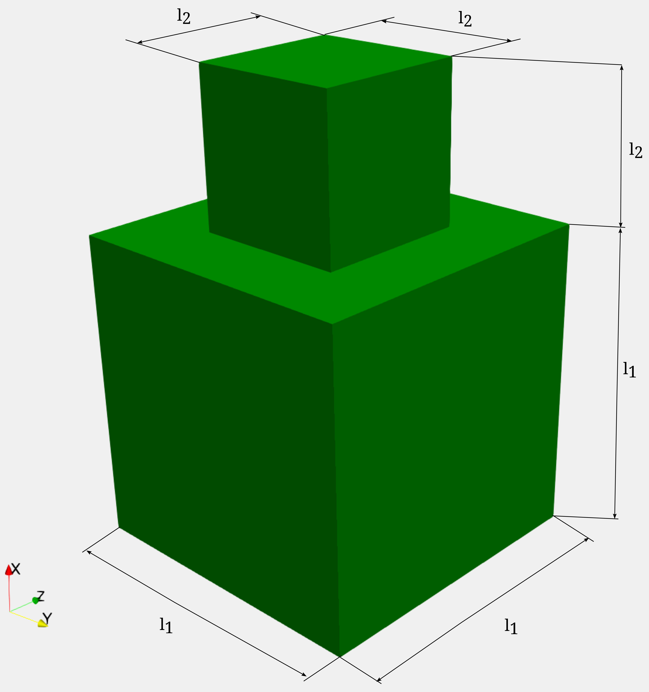
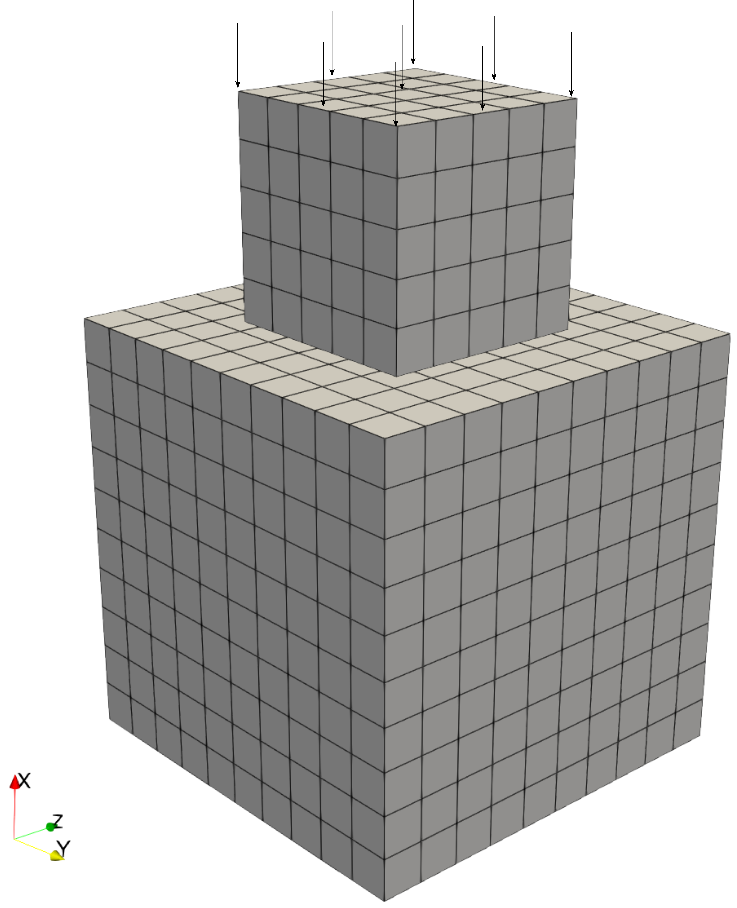
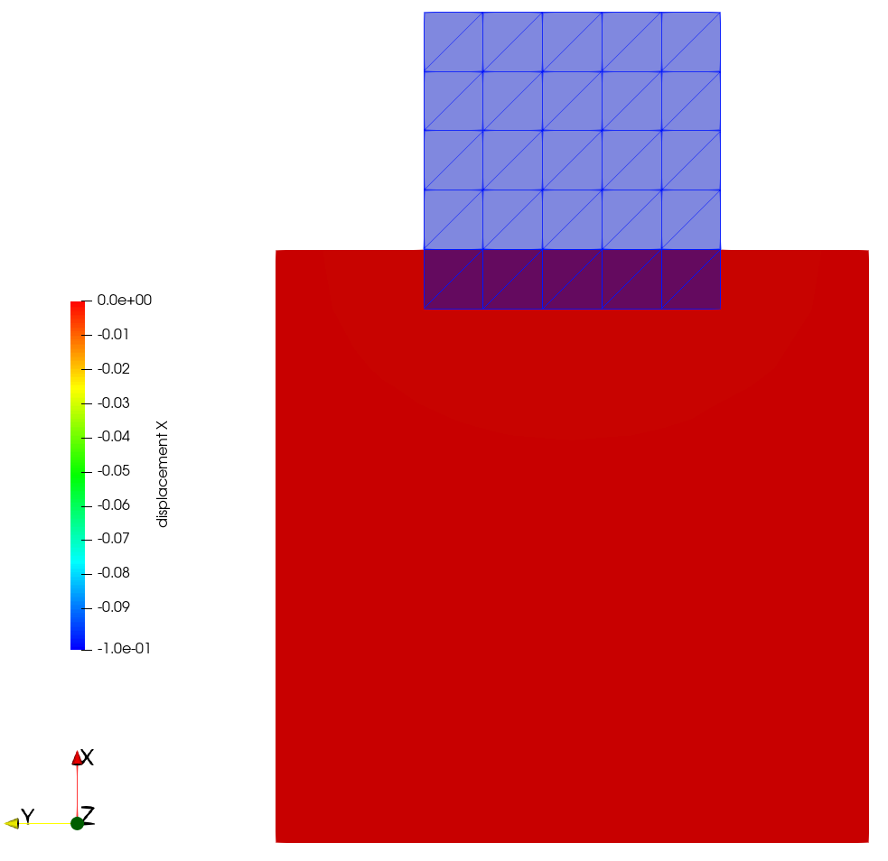
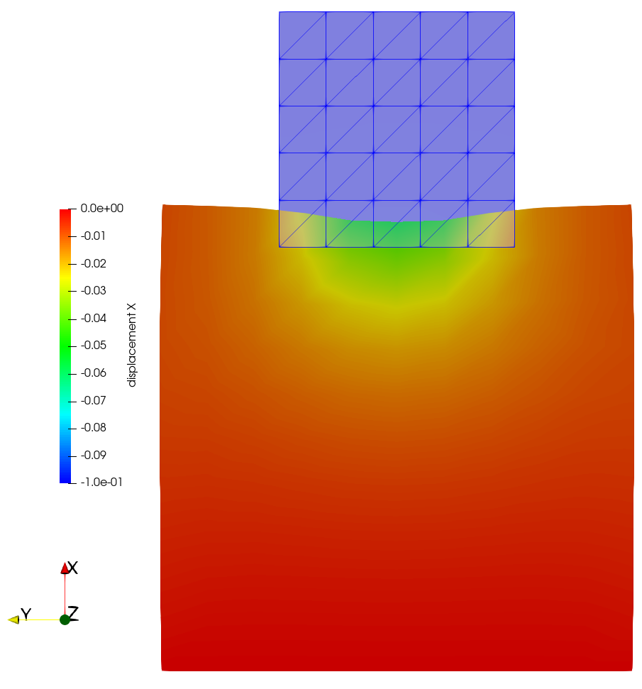
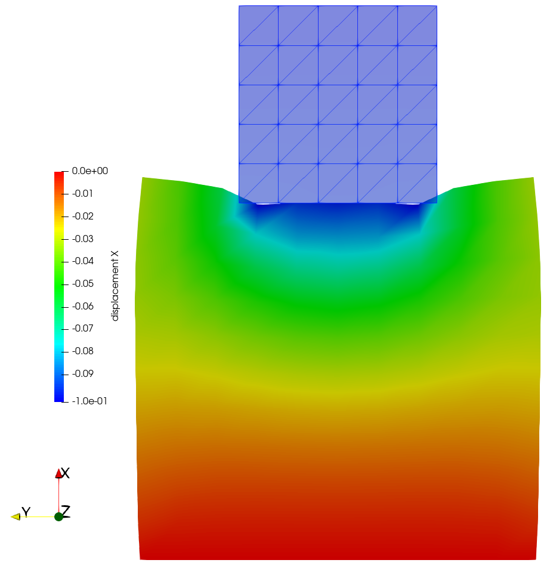
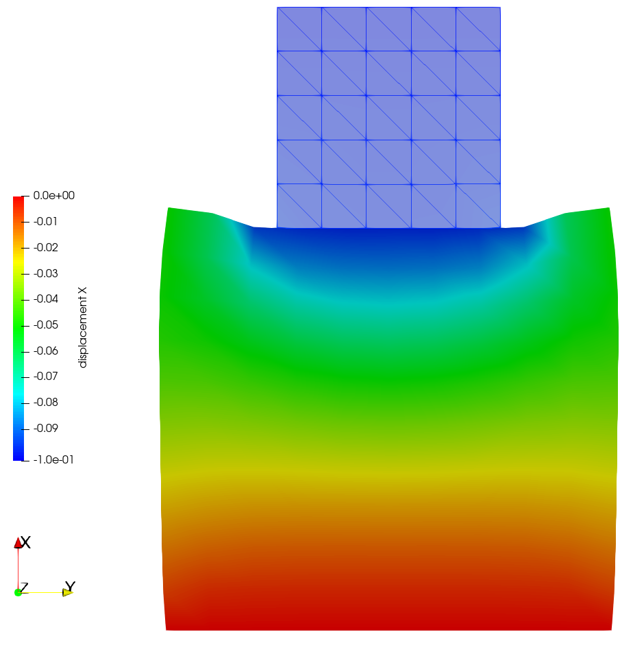

# Introduction to contact mechanics in 4C

Two cubes of different sizes, consisting of different materials, are pressed onto each other for this simple contact mechanics tutorial.

## Prerequisites

All prerequisites are met for the UKACM GACM workshop by setting up the provided virtual machine.

## Introduction

The analyzed problem setup contains two elastic cuboids of different dimensions, consisting of materials with different mechanical properties pressed onto each other. The geometry of the problem setup is shown in the subsequent figure

|  |
| :--: |
| *Geometrical setup of the contact test.* |

with measures as listed in the table below

| Quantity | Length in (mm) |
| --- | --- |
| $`l_1`$ | 0.5 |
| $`l_2`$ | 1 |

The materials chosen in this tutorial are artificial. The material of the lower block is softer, represented by the elastic properties $` \text{E}_1 = 100 `$ MPa, $` \nu_1 = 0.3`$, while the upper block has the elastic properties $` \text{E}_2 = 4000 `$ MPa, $` \nu_2 = 0.3`$.

## Preprocessing

The mesh of the discretized problem setup used in this tutorial is shown in the figure below.

|  |
| :--: |
| *Mesh of the problem setup including arrows to visualize the displacement boundary condition that drives the deformation.* |

The discretization of the upper and lower blocks does not coincide. Thus, we obtain non-matching discretizations at the contact interface as soon as the bodies get into contact due to the prescribed displacement.

## Working with 4C

### Creation of a valid 4C input file

To simulate the described problem using **4C**, a valid **4C** input file is necessary. A valid template input file for this problem is already provided with the file `tutorial_contact_3d.4C.yaml`. As this is the second **4C** tutorial, we will briefly walk you through sections that did not appear in the first tutorial, but repeat some helpful hints first.

> **Hint** Use VS Code to open the **4C** input files. VS Code is set up to use the JSON Schema file (`4C_schema.json`) provided by **4C**. This can be very helpful as it enables to display the documentation of the parameters, allows for auto completion, and shows the different options that can be set.  
> The file ending of the 4C input files is `.4C.yaml`.

> **Hint** The documentation of the [input parameters](https://4c-multiphysics.github.io/4C/documentation/input_parameter_reference/parameterreference.html#input-parameter-reference) can also be very helpful to adapt the input files.

Since this is still a solid mechanics problem, many definitions are similar to those in the [first tutorial](https://github.com/mayrmt/UKACM_GACM_Tutorial_4C_QUEENS/tree/main/4C/01_solid_mechanics#introduction-to-solid-mechanics-in-4c). The main difference from a solid mechanics perspective is that we do not assume a quasi-static problem setup but account for the dynamics of the system.

```yaml
STRUCTURAL DYNAMIC:
  INT_STRATEGY: Standard
  DYNAMICTYPE: GenAlpha
```

Therefore, the time integration scheme is chosen to be Generalized-$`\alpha`$ (`DYNAMICTYPE: GenAlpha`). Moreover, as it is a contact problem, additional contact related parameters must be defined. This is done with the subsequent sections

```yaml
MORTAR COUPLING:
  ALGORITHM: Mortar
  LM_SHAPEFCN: Standard
CONTACT DYNAMIC:
  STRATEGY: Penalty
  PENALTYPARAM: 2.0e2
  LINEAR_SOLVER: 1
```

In this tutorial, a segment-to-segment contact formulation, namely a mortar approach, is used for the contact interface discretization. Therefore, the `MORTAR COUPLING` section has been added, and the `ALGORITHM` has been chosen as `Mortar`. Furthermore, shape functions for the mortar discretization are chosen to be standard Lagrange shape functions (`LM_SHAPEFCN: Standard`). In contact problems, additional constraints need to be fulfilled. For normal contact without friction or adhesion effects, these are described by the following set of equations

```math
g_\text{n} \geq 0,\\
p_\text{n} \leq 0,\\
g_\text{n} p_\text{n} = 0
```

where the first equation expresses that the gap $` g_\text{n} `$, i.e., the distance between the two bodies, must be non-negative to avoid a penetration of the body. The second equation states that only compressive contact stresses $` p_\text{n} = \boldsymbol{n} \cdot \boldsymbol{\sigma} \cdot \boldsymbol{n} `$ (Cauchy stress tensor: $`\boldsymbol{\sigma}`$, local normal vector: $`\boldsymbol{n}`$) can be transferred. Remember that we excluded effects like adhesion in the beginning. Finally, the last equation states a compatibility condition, meaning that if the gap is zero, we have compressive stresses in the interface, and when the gap is larger than zero, i.e., the bodies are not in contact, the contact stress has to be zero. For more information on contact methods in general please refer to [^1] and [^2], while for mortar methods we refer to [^3] and [^4].

There are different possibilities to enforce such constraints within a numerical model. In this tutorial, we will work with the `Penalty` and `Lagrange multiplier` methods. The Lagrange multiplier method introduces new degrees of freedom, the Lagrange multipliers, to the numerical model. In the converged state, the values of the Lagrange multipliers can be interpreted as the forces necessary to fulfill the constraints. In contrast, the Penalty method by construction allows for a violation of the constraints but penalizes the constraint violation. The penalty parameter is the relevant parameter to tune to which extent the constraints are violated. This method can be viewed as a regularized variant of the Lagrange multiplier approach, where, in theory, the exact solution is recovered as the penalty parameters tend toward infinity.

Initially, this tutorial uses the Penalty method (`STRATEGY: Penalty`). This constraint enforcement method requires a so-called penalty parameter, which is set to be `2.0e2`. On top of that, a linear solver must be defined (`LINEAR_SOLVER: 1`) for the contact problem.

The contact interface, i.e., the surfaces that might come into contact, must be defined. This is done with the following lines in the input file

```yaml
DESIGN SURF MORTAR CONTACT CONDITIONS 3D:
  - E: 1
    ENTITY_TYPE: node_set_id
    InterfaceID: 1
    Side: Slave
  - E: 2
    ENTITY_TYPE: node_set_id
    InterfaceID: 1
    Side: Master
```

stating that a three-dimensional contact problem shall be solved. Moreover, two surfaces are defined to be part of the contact interface with `InterfaceID: 1`, defining that the contact constraints shall be enforced for this pair of surfaces. Additionaly, a distinction in `Master` and `Slave` is common in the contact community. This is also done here by the parameter `Side`. In contrast to the simpler approach of node-to-segment (`NTS`), the decision which side is `Master` and which is `Slave` is not that important.

The [execution](https://github.com/mayrmt/UKACM_GACM_Tutorial_4C_QUEENS/tree/main/4C/01_solid_mechanics#execute-a-4c-simulation) of **4C** and the [post-processing](https://github.com/mayrmt/UKACM_GACM_Tutorial_4C_QUEENS/tree/main/4C/01_solid_mechanics#post-processing) work as described in the previous tutorial and is not repeated here.


## Numerical analyses

### Step 1

First, we want to analyze the properties of the penalty method for contact constraint enforcement. As described above, a penetration of the bodies is inherent to this method, as the penetration is penalized by adding a penalty term that scales with the penalty parameter. Thus, your task is to evaluate the influence of the penalty parameter on the simulation result.

<details>
<summary>Solution</summary>

The task is to play around with the values of the penalty parameter, i.e.,

```yaml
CONTACT DYNAMIC:
  STRATEGY: Penalty
  PENALTYPARAM: 2.0e2 # vary this value here
```

and check how this affects the solution of your problem.

You will encounter the penetration of the bodies getting higher for lower penalty parameter values. For sufficiently small penalty parameters, the penetration of the bodies gets so high that the contact algorithm no longer detects that the surfaces are actually in contact, and the bodies freely penetrate each other.

For higher values of the penalty parameter, the penetration of the bodies gets smaller, as expected. However, a large penalty parameter also leads to a bad conditioning of the linear system. Thus, the linear solver will not solve if the penalty parameter gets too high.

|  |  |  |
| :--: | :--: | :--: |

*Displacement field solution for three different penalty paramters. **Left:** Penalty parameter so low, that penetration is so large that contact search is not successful any more. **Middle:** Small penalty parameter leading to significant penetration. **Right:** High penalty paramter resulting in only small penetrations.*

> **Hint:** To check if the bodies are still in contact you can either use ParaView and visualize, e.g., the deformation field. As an alternative, you can also check the screen output for the following lines
>```bash
>    Converged....Contact-Normal-Active-Set-Size = 49
>  **...........Number of Iterations = 3 < 50
>```
>
>where the output `Contact-Normal-Active-Set-Size` describes how many discrete nodes are actually in contact. Thus, if no contact is found anymore, the number is `0`.

</details>

### Step 2

The penalty method is an established method, as it is easy to implement and often performs quite well, despite the obvious drawbacks you have encountered during the last couple of simulations. Thus, we want to move your attention to an alternative constraint enforcement method that uses Lagrange multipliers. To achieve that, you need to adapt the `MORTAR COUPLING` and `CONTACT DYNAMIC` sections of your input file as follows

```yaml
MORTAR COUPLING:
  ALGORITHM: Mortar
  LM_SHAPEFCN: Dual
CONTACT DYNAMIC:
  LINEAR_SOLVER: 1
  STRATEGY: Lagrange
```

<details>
<summary>Solution</summary>

When you execute the simulation, you will see that the penetration of the bodies is gone (see figure below).

|  |
| :--: |
| *Displacement field solution for the Lagrange multiplier constraint enforcement method.* |

This is because the constraint enforcement using the Lagrange multipliers is exact in a weak sense. However, this method comes with other challenges, e.g., a saddlepoint structure of the linear system that requires specialized linear solvers, especially for large systems when iterative solvers are needed. One possible remedy to this issue is using so-called dual shape functions (see the definition above), which enable a complete condensation of the Lagrange multipliers and thereby remove the saddlepoint structure of the linear system.

</details>

[^1]: T. A. Laursen. Computational Contact and Impact Mechanics: Fundamentals of Modeling Interfacial Phenomena in Nonlinear Finite Element Analysis, 2003  
[^2]: P. Wriggers. Computational Contact Mechanics, 2006  
[^3]: A. Popp, M. Gitterle, M. W. Gee, W. A. Wall. A dual mortar approach for 3D finite deformation contact with consistent linearization, International Journal for Numerical Methods in Engineering, 2010  
[^4]: M. A. Puso, T. A. Laursen. A mortar segment-to-segment contact method for large deformation solid mechanics, Computer Methods in Applied Mechanics and Engineering, 2004
