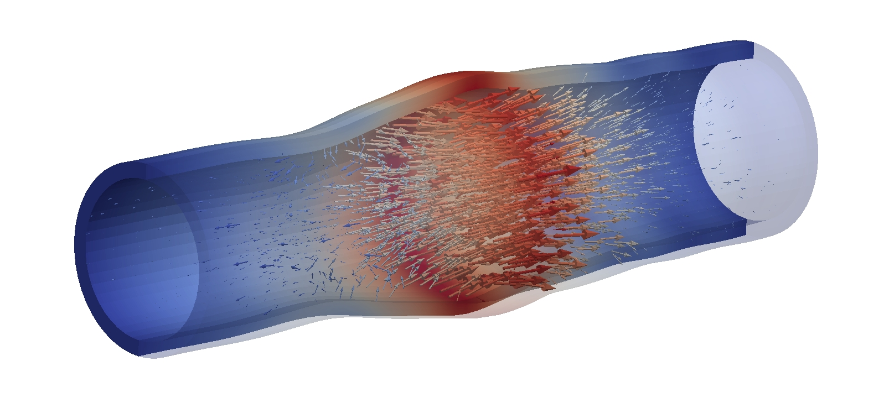
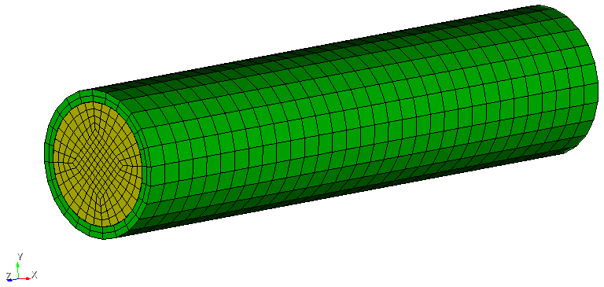

# Introduction to monolithic fluid/solid interaction in 4C

This tutorial demonstrates the simulation of a fluid/solid interaction (FSI) problem using a monolithic approach. FSI describes the two-way coupled interaction of solid bodies with fluid flow. A detailed introduction to all flavors of FSI is way beyond the scope of this tutorial. To this end, this tutorial focuses on the following scenario: the solid domain is governed by the equations of elastodynamics, while the flow domain is subject to incompressible Navier-Stokes equations described by an Arbitrary Lagrangean-Eulerian (ALE) observer.

As concrete example, this tutorial studies a pressure wave through an elastic tube. The tube is clampled at both ends and is fully filled with fluid. Both solid and fluid are initially at rest. As external excitation, a pressure pulse is applied to one of the fluid's boundary cross sections, resulting in a pressure wave traveling along the longitudinal axis of the tube. This also causes a traveling radial expansion of the tube traveling in line with the pressure wave. This problem has originally been introduced in [Gerbeau2003a] and is designed to mimic hemodynamic conditions, especially w.r.t. to the material densities with the ratio $\rho^S/\rho^F \approx 1$. Nowadays, it is widely considered a benchmark for monolithic solvers in the FSI community.

## What you will learn in this tutorial

After completion of this tutorial, you will know

- how to set up an FSI problem in 4C;
- how to define meshes, materials, and boundary conditions;
- how to solve the arising linear system with direct and iterative solvers;
- how to interpret the results (pressure wave propagation in an elastic tube).

## Problem description

The system consists of a straight, thin-walled solid tube (length $\ell = 5 cm$, outer radius $r_o = 0.6 cm$, inner radius $r_i = 0.5 cm$) that is filled with fluid. The solid tube is fully clamped at both ends. Both solid and fluid are initially at rest.

As external excitation, the fluid surface at $z = 0$ is loaded with a surface traction $h^F = 1.3332\cdot 10^4 g\cdot cm/s^2$ in $z$-direction for the duration of $3\cdot 10^{−3} s$. The fluid velocities at $z=\ell$ are prescribed to zero, essentially closing the tube at the far end.

The pressure pulse travels along the longitudinal axis of the tube, causing a traveling radial dilation of the tube:



A detailed analysis of mesh dependence and time integration schemes as well as a series of snapshots of the solution as well as plots for displacement and pressure over time obtained with 4C can be found in [Mayr2015a,Mayr2016a].

## Model setup in 4C

To create a 4C model and input file, at least two ingredients are required:

- The finite element mesh in a suitable mesh format
- A `*.4C.yaml` file with all simulation parameters and boundary conditions

This tutorial comes with ready-to-use mesh files, so that the focus can be put on creating input files for 4C simulations. In the next steps, you will create your own 4C input file with all necessary simulation parameters, material definitions and boundary conditions and link it to existing finite element mesh files.

### Predefined mesh files

This tutorial comes with a series of ready-to-use meshes with different mesh resolutions.
The following meshes are available (along with recommendation for the number of MPI ranks to run each mesh):

| Filename  | Global number of DOFs | MPI ranks |
|-----------|-----------------------|-----------|
| pw_m1.exo | 8406                  | 1         |
| pw_m2.exo | 58333                 | 2         |
| pw_m3.exo | 187516                | 8         |

Each mesh file contains both solid and fluid mesh. The mesh for the mesh motion problem will be generated at run time (see [On-the-fly generation of ALE mesh](#on-the-fly-generation-of-ale-mesh)). See for example the mesh `pw_m2.exo`:



The solid domain is colored in green, the fluid domain in yellow. Note the non-matching grids at the fluid/solid interface.

The mesh contains the following node sets:

| Node Set ID | Node Set Name           | Description |
|-------------|-------------------------|-------------|
| 1           | solid_fsi_surf          | FSI interface of the solid domain |
| 2           | fluid_fsi_surf          | FSI interface of the fluid domain |
| 3           | solid_clamp_surf        | Fully constrained solid surfaces at both ends of the tube |
| 4           | fluid_inflow_surf       | Fluid surface subject to the pressure pulse |
| 5           | fluid_outflow_surf      | Fluid surface at the other end of the tube |
| 6           | solid_fsi_no_dbc_curves | Solid nodes at the intersection of Dirichlet boundary and FSI interface (not relevenat for this tutorial) |
| 7           | fluid_fsi_no_dbc_curves | Fluid nodes at the intersection of Dirichlet boundary and FSI interface (not relevenat for this tutorial) |

Both solid and fluid are meshed with eight-noded hexahedral elements to support a finite element basis with 1st order Lagrange polynomials.

### Creating the 4C input file

You will now create the 4C input file. Therefore, create a new file entitled `pw.4C.yaml`.
Now, insert the first set of simulation parameters:

- Define the problem type in order to solve a fluid/solid interaction problem:

   ```yaml
   PROBLEM TYPE:
     PROBLEMTYPE: "Fluid_Structure_Interaction"
   ```

- Define the spatial dimension:

   ```yaml
   PROBLEM SIZE:
      DIM: 3
   ```

### Defining single fields

In order to solve an FSI problem, you now need to define the involved single fields (solid, fluid, ALE mesh motion)
as well as the interaction among them.
First, let's define the individual fields:

- Define the **solid** field and time integration strategy:

	Core parameters for the solid field and time integration strategy are given in the list `STRUCTURAL DYNAMIC`:

   ```yaml
   STRUCTURAL DYNAMIC:
     INT_STRATEGY: "Old"
     LINEAR_SOLVER: 1
   ```

   The `INT_STRATEGY: "Old"` points the solid field towards the implementation of solid time integation schemes, that is ready for FSI problems.
   For a field to be fully defined, it needs to define a `LINEAR_SOLVER` by referring to a solver section, in this case `1`, that will be defined later.
   In this tutorial, we rely on the solid's default time integration scheme, Generalized-Alpha time integration with a spectral radius of 1.0 [Chung1993a].

   > **Link to documentation:** See the [solid time integration documentation](https://4c-multiphysics.github.io/4C/documentation/headerreference.html#structural-dynamic) for details and further options.

- Define a **fluid** field and time integration strategy:

   Core parameters for the fluid field and time integration strategy are given in the list `FLUID DYNAMIC`:


   ```yaml
   FLUID DYNAMIC:
     LINEAR_SOLVER: 1
     NONLINITER: Newton
     TIMEINTEGR: "Np_Gen_Alpha"
     ALPHA_M: 0.5
     ALPHA_F: 0.5
     GAMMA: 0.5
     GRIDVEL: BDF2
   ```

   Similar to the solid field, a default `LINEAR_SOLVER` must be defined. `NONLINITER: Newton` instructs the fluid field to assemble _all_ linearization terms, such that the monolithic FSI scheme can solve the nonlinear problem in each time step with a Newton method using a consistent linearization of all residual terms.
   A 2nd-order backward differentiation formula (BDF2) is used to approximate the grid velocity in the ALE description of the Navier-Stokes equations based on the ALE Mesh displacements.
   The fluid field performs time integration via the Generalized-alpha scheme [Jansen2000a] with parameters `ALPHA_M`, `ALPHA_F` and `GAMMA` as given.

   > **Link to documentation:** See the [fluid time integration documentation](https://4c-multiphysics.github.io/4C/documentation/headerreference.html#fluid-dynamic) for details and further options.

- Define the **ALE mesh motion** field:

   The mesh motion problem of the ALE formulation of the fluid domain is defined as follows:

   ```yaml
   ALE DYNAMIC:
     ALE_TYPE: springs_material
     LINEAR_SOLVER: 1
   ```

   The `ALE_TYPE` specifies the mesh motion algorithm to interpret the mesh as a network of springs. Similar to solid and fluid field, a default `LINEAR_SOLVER` must be defined.

### Defining the FSI coupling interaction

We can now define the FSI algorithm. In particular, we have to specify the FSI coupling algorithms, some aspects of time discretization, as well as details on the coupling iterations.

First, we describe the overall FSI procedure by adding the following lines to the 4C input file:

```yaml
FSI DYNAMIC:
  COUPALGO: "iter_mortar_monolithicfluidsplit"
  SECONDORDER: true
  MAXTIME: 0.02
  TIMESTEP: 0.0001
```

To enable non-matching grids at the FSI interface with Lagrange multiplier unknowns for constraint enforcement being defined on the fluid side of the interface, we specify the coupling algorihtm `COUPALGO` as `"iter_mortar_monolithicfluidsplit"`.
The setting `SECONDORDER: true` yields a 2nd order conversion between displacements and velocities at the FSI interface.
We then run the simulation with a `TIMESTEP` of `0.0001` up to a maximum simulation time `MAXTIME` of `0.001`.

> We start with a short simulation to get things up and running. Feel free to switch to an extended `MAXTIME` at a later stage in order to give the pressure wave time to travel through the elastic tube.

For details on the FSI algorithm, see [Kloeppel2011a,Mayr2015a].

To solve the nonlinear FSI problem with a monolithic approach, insert the following section:

```yaml
FSI DYNAMIC/MONOLITHIC SOLVER:
  SHAPEDERIVATIVES: true
  LINEARBLOCKSOLVER: "LinalgSolver"
  LINEAR_SOLVER: 2
  TOL_DIS_RES_L2: 1e-08
  TOL_DIS_RES_INF: 1e-08
  TOL_DIS_INC_L2: 1e-08
  TOL_DIS_INC_INF: 1e-08
  TOL_FSI_RES_L2: 1e-08
  TOL_FSI_RES_INF: 1e-08
  TOL_FSI_INC_L2: 1e-08
  TOL_FSI_INC_INF: 1e-08
  TOL_PRE_RES_L2: 1e-08
  TOL_PRE_RES_INF: 1e-08
  TOL_PRE_INC_L2: 1e-08
  TOL_PRE_INC_INF: 1e-08
  TOL_VEL_RES_L2: 1e-08
  TOL_VEL_RES_INF: 1e-08
  TOL_VEL_INC_L2: 1e-08
  TOL_VEL_INC_INF: 1e-08
```

Therein, `SHAPEDERIVATIVES: true` includes the linearization of fluid residuals with respect to the mesh deformation into the FSI Jacobian matrix [Mayr2015a].
The choice of `LINEARBLOCKSOLVER: "LinalgSolver"` instructs the monolithic solution scheme to solve the linear system through 4C's centralized linear solver interface, `LinalgSolver`, and refers to a linear solver with ID `2` (to be defined later) for the concrete parametrization of the linear solver.
The remaining parameters specify the tolerances for the convergence test of the nonlinear solver, that tests convergence of solid displacements, fluid velocities and pressures, as well as interface quantities separately and each in 2- and inf-norm (see Appendix A.1 of [Mayr2020a] for details).

### Defining the constitutive behavior of each field

So far, we have defined time integration parameters for the involved solid, fluid, and mesh motion field. Yet, the constitutive behavior of solid and fluid are still missing.

They are defined as follows:

```yaml
MATERIALS:
  - MAT: 1
    MAT_fluid:
      DYNVISCOSITY: 0.03
      DENSITY: 1
      GAMMA: 1
  - MAT: 2
    MAT_Struct_StVenantKirchhoff:
      YOUNG: 3e+6
      NUE: 0.3
      DENS: 1.2
```

Thereby, `MAT: 1` specifies a Newtonian fluid for the fluid domain, while `MAT 2` defines a St.-Venant-Kirchhoff material for the solid domain. Values correspond to the pressure wave example [Gerbeau2003a].

> **Link to documentation:** For details, see the 4C documentation: [Newtonian fluid](https://4c-multiphysics.github.io/4C/documentation/materialreference.html#mat-fluid), [St.-Ventant-Kirchhoff](https://4c-multiphysics.github.io/4C/documentation/materialreference.html#mat-struct-stvenantkirchhoff)

### Geometry and mesh infomration

Geometry and mesh information are provided in ready-to-use mesh files for this tutorial.

> **Link to documentation:** A brief introduction to meshes in 4C is given in the [preprocessing documentation](https://4c-multiphysics.github.io/4C/documentation/analysis_guide/preprocessing.html).

</br>

> The documentation on preprocessing is currently undergoing changes due to changes to the input format of 4C. In particular, we are adding more mesh formats. Stay tuned!

#### Solid domain and mesh

The solid geometry and its mesh are pre-defined in mesh files, cf [predefined mesh files](#predefined-mesh-files). To use it in a 4C simulation, the input file needs to refer to the solid mesh as follows:

```yaml
STRUCTURE GEOMETRY:
  FILE: "pw_m2.exo"
  ELEMENT_BLOCKS:
    - ID: 1
      SOLID:
        HEX8:
          MAT: 2
          KINEM: nonlinear
          TECH: eas_full
```

Therein, `FILE: "pw_m2.exo"` points to the pre-defined mesh file.
The solid domain is defined as one of the meshes `ELEMENT_BLOCKS`, in this case the block with `ID: 1`. The elements in this block will be finite elements with `ELEMENT_NAME: SOLID` and `ELEMENT_DATA: "MAT 2 KINEM nonlinear TECH eas_full"`.

#### Fluid domain and mesh

Similarly, the fluid geometry and mesh is included via:

```yaml
FLUID GEOMETRY:
  FILE: "pw_m2.exo"
  ELEMENT_BLOCKS:
    - ID: 2
      FLUID:
        HEX8:
          MAT: 1
          NA: ALE
```

#### On-the-fly generation of ALE mesh

Meshes for solid and fluid are part of the pre-defined mesh file. It is common practice to use the fluid mesh also for the mesh motion problem. Thus, it can be created from the fluid mesh at run time.

Therefore, insert the following section into the 4C input file:

```yaml
CLONING MATERIAL MAP:
  - SRC_FIELD: "fluid"
    SRC_MAT: 1
    TAR_FIELD: "ale"
    TAR_MAT: 2
```

It specifies to clone a field. Source and target fields are identified via the IDs of their material. In this case, `SRC_FIELD: "fluid"` with `SRC_MAT: 1` is used as the source field. The cloning operation will generate a target field defined by `TAR_FIELD: "ale"` and will assign it the target material `TAR_MAT: 2`.

### Boundary conditions

To apply the required boundary and coupling conditions, we will look at each type of boundary condition separately.

To impose a boundary condition, we need to specify not only its type and values, but also the mesh entities of the degrees of freedom that are subject to his boundary condition. A list of relevant mesh entities is given in the table with all node sets of the [predefined mesh files](#predefined-mesh-files).

#### Essential / Dirichlet boundary conditions

In the pressure wave example, there are only two types of Dirichlet conditions:

- Clamping of the solid tube at both ends
- Fixation of fluid mesh motion at both ends of the tube

We start with the two end surfaces of the solid tube. They are fully clamped, i.e., all three displacements are constrained to zero at the respective surfaces. This can be achieved by defining a `DESIGN SURF DIRICH CONDITIONS` in the 4C input file:

```yaml
DESIGN SURF DIRICH CONDITIONS:
  - E: 3
    ENTITY_TYPE: node_set_id
    NUMDOF: 3
    ONOFF: [1,1,1]
    VAL: [0.0,0.0,0.0]
    FUNCT: [null,null,null]
```

Explanation:

- `E: 3`: This defines the location of the Dirichlet condition, which refers to the list of node sets: all nodes of the solid end surfaces are stored in node set `3`.
- `ENTITY_TYPE: node_set_id`: Adds context that the `E: 3` needs to be interpreted as an ID of a node set.
- `NUMDOF: 3`: The solid field has three degrees of freedom per node.
- `ONOFF: [1,1,1]`: Activate the Dirichlet boundary condition for each of the degrees of freedom at a node.
- `VAL: [0.0,0.0,0.0]`: Specify the value of the prescribed displacament for each of the degrees of freedom at a node.

The ALE mesh motion at the fluid cross section areas at both ends of the tube is constrained via `DESIGN SURF ALE DIRICH CONDITIONS`. Its internal setup is the same as a regular Dirichlet condition (for example such as the one in the solid field), however the addendum of `ALE` is required since the ALE mesh motion field is not defined in the mesh file, but has been created by cloning the fluid discretization. The boundary condition reads:

```yaml
DESIGN SURF ALE DIRICH CONDITIONS:
  - E: 4
    ENTITY_TYPE: node_set_id
    NUMDOF: 3
    ONOFF: [1,1,1]
    VAL: [0.0,0.0,0.0]
    FUNCT: [null,null,null]
  - E: 5
    ENTITY_TYPE: node_set_id
    NUMDOF: 3
    ONOFF: [1,1,1]
    VAL: [0.0,0.0,0.0]
    FUNCT: [null,null,null]
```

Since the fluid cross section areas at both ends of the tube are stored in two different nodes sets (to later on allow to impose the pressure pulse only on one of the surfaces), the ALE Dirichlet boundary condition must be applied for each of the surfaces, this case and in accordance with the mesh details from the [predefined mesh files](#predefined-mesh-files) for `E: 4` and `E: 5`. All other parameters follow the same logic as the Dirichlet boundary condition for the solid field and impose a zero-displacement-condition for all ALE degrees of freedom on the two surfaces.

#### Flux / Neumann boundary conditions

The pressure pulse onto the fluid will be modeled as a Neumann boundary condition. It acts onto the "inflow" surface of the fluid domain. Its definition in the 4C input file reads:

```yaml
DESIGN SURF NEUMANN CONDITIONS:
  - E: 4
    ENTITY_TYPE: node_set_id
    NUMDOF: 4
    ONOFF: [0,0,1,0]
    VAL: [0,0,-13332,0]
    FUNCT: [null,null,1,null]
```

- `E: 4`: The inflow surface is one of the two fluid cross sections, see [predefined mesh files](#predefined-mesh-files).
- `ENTITY_TYPE: node_set_id`: Adds context that the `E: 3` needs to be interpreted as an ID of a node set.
- `NUMDOF: 4`: The three-dimensional flow problem has four degrees of freedom per node, namely three velocities and one pressure unknown.
- `ONOFF: [0,0,1,0]`: Given the orientation of the tube in the global frame of reference, the external traction must act in negative z-direction of the velocity degrees of freedom. Due to the internal ordering (x-, y-, z-velocities, pressure) of unknows at each fluid node, the third component is activated by setting `1`, while all other components remain inactive by setting `0`.
- `VAL: [0,0,-13332,0]`: Following the same argument, only the third component nees to carry an actual value, in this case the value of the traction in negative z-direction.
- `FUNCT: [null,null,1,null]` specifies the (time-dependent) function `FUNCT 1` for the z-component of the external load.

The pressure pulse will be imposed as a peak at the beginning of the simulation. It is modeled as a linear interpolation between user-given values in function `FUNCT 1` as follows:

```yaml
FUNCT1:
  - COMPONENT: 0
    SYMBOLIC_FUNCTION_OF_SPACE_TIME: "initial pressure pulse"
  - VARIABLE: 0
    NAME: "initial pressure pulse"
    TYPE: "linearinterpolation"
    NUMPOINTS: 4
    TIMES: [0,0.003,0.0031,10000]
    VALUES: [1,1,0,0]
```

#### FSI coupling condition

The mesh comes with non-matching grids at the fluid/solid interface. Therefore, we employ a mortar approach to impose the coupling conditions [Kloeppel2011a,Mayr2015a].

According to the [predefined mesh files](#predefined-mesh-files), the solid side of the interface is stored in node set `1`, while the fluid side of the interface is stored in node set `2`. Both sides need to be defined as FSI coupling partners:

```yaml
DESIGN FSI COUPLING SURF CONDITIONS:
  - E: 1
    ENTITY_TYPE: node_set_id
    coupling_id: 1
  - E: 2
    ENTITY_TYPE: node_set_id
    coupling_id: 1
```

Again, `E: 1` and `E: 2` are the IDs with `ENTITY_TYPE: node_set_id` instructing to interpret them as node set IDs. The `coupling_id: 1` assigns both coupling surfaces to the FSI interface `1`.

### Linear solver

In this tutorial, we will explore two different solver options for monolithic FSI problesm: direct vs. iterative. While direct solvers are easy to use, since they do not require the choice of solver parameters, they are often less efficient than properly preconditioned iterarative linear solvers.

#### Direct solver

First, we start with a direct solver. It is defined as follows:

```yaml
SOLVER 1:
  SOLVER: "UMFPACK"
```

This enables `UMFPACK` [Davis2004a] as direct solver, which will compute an LU factorization of the FSI system matrix and use it to solve the arising linear system of equations.

To tell the FSI algorithm to use this solver, make sure to assign the value `1` to the input parameter `LINEAR_SOLVER` in the `FSI DYNAMIC/MONOLITHIC SOLVER:` section of the 4C input file.

#### Iterative solver with preconditioner

To overcome performance and feasibility limitations of direct solvers, let us now explore iterative solvers with appropriate preconditioning.
Therefore, define a second solver in the 4C input file by adding:

```yaml
SOLVER 2:
  SOLVER: "Belos"
  AZPREC: "MueLu"
  AZREUSE: 10
  SOLVER_XML_FILE: "gmres.xml"
  MUELU_XML_FILE: "muelu_solid_fluid_ale.xml"
```

The parameter `SOVLER: "Belos"` enables a Generalized Minimal Residual (GMRES) solver [Saad1986a] from Trilinos' Belos package [Bavier2012a] as iterative solver, which will approximate the solution of the linear system up to a user-given tolerance. The exact settings of the GMRES method are pre-defined in `gmres.xml`. To accelerate convergence of the GMRES solver, `AZPREC` points 4C to use Trilinos' `MueLu` package as a preconditioner. In this tutorial, we employ a fully coupled algebraic multigrid preconditioner tailored to FSI systems as proposed in [Gee2011a]. It is defined in `muelu_solid_fluid_ale.xml`. By setting `AZREUSE: 10`, the preconditioner can be reused up to ten times in order to save the cost for preconditioner setup.

> **Note on file locations:** Support files (such as the solver configuration `gmres.xml` or the preconditioner configuration `muelu_solid_fluid_ale.xml` can be placed anywhere, however the 4C input file needs to refer to these files by either relative or absolute paths. In this tutorial, we assume that these files are in the same directory as the 4C input file `pw.4C.yaml`.

</br>

> **Configuration files for solvers and preconditioners:** Since configuration files for solvers and preconditioners can often be reused and are hard to write from scratch, the 4C repository comes with a collection of useful solver and preconditioner configurations. Consult the 4C repository at `tests/input_files/xml/` for solver configurations and exemplary configurations for different types of preconditioners.

</br>

> **Link to documentation:** For details on the use and defintion of iterative solvers and multigrid preconditions in 4C, we refer to [4C's preconditioning tutorial](https://4c-multiphysics.github.io/4C/documentation/tutorials/tutorial_preconditioning.html).

To tell the FSI algorithm to use `SOLVER 2`, make sure to assign the value `2` to the input parameter `LINEAR_SOLVER` in the `FSI DYNAMIC/MONOLITHIC SOLVER:` section of the 4C input file.

## Running the FSI Simulation

With a complete `*.4C.yaml` input file at hand, you are now in the position to run the simulation.

### Prerequesites

To run a 4C simulation, you need a compiled 4C executable and 4C input data.

- **Executable:** In this tutorial, you can use the pre-compiled 4C executable provided within the virtual machine for this tutorial. We assume the 4C executable to be located at `<path/to/4C/executable>`. In this tutorial, it is located at: INSERT PATH TO EXECUTABLE HERE!!
- **4C mesh file:** For this tutorial, please use one of the pre-defined mesh files `pw_m*.exo` as described in the section on [predefined mesh files](#predefined-mesh-files).
- **4C input file:** For this tutorial, please use the input file `pw.4C.yaml` that you have created in the previous steps, cf. [creating the 4C input file](#creating-the-4C-input-file). We assume the 4C input to be located at `<path/to/4C/input/file>`.

### Starting a 4C simulation

4C can run in parallel distributed to multiple cores. We denote the number of cores by `<numCores>` throughout this tutorial.

To write output, the user has to provide an output prefix that is used for all output files. We assume output to be prefixed by `<path/to/output>`.

To run 4C on `<numCores>` cores, execute the following command:

```bash
mpirun -np <numCores> <path/to/4C/executable> <path/to/4C/input/file> <path/to/output>
```

## Visualization of results


---

## References

**[Bavier2012a]** E. Bavier, M. Hoemmen, S. Rajamanickam, and H. Thornquist. Amesos2 and Belos: Direct and Iterative Solvers for Large Sparse Linear Systems. Scientific Programming, 20(3):241–255, 2012

**[Chung1993a]** J. Chung and G. Hulbert. A Time Integration Algorithm for Structural Dynamics With Improved Numerical Dissipation: The Generalized-Alpha Method. Journal of Applied Mechanics, 60(2):371–375, 1993

**[Davis2004a]** T. A. Davis. Algorithm 832: UMFPACK V4.3 — an Unsymmetric-pattern Multifrontal Method. ACM Transactions on Mathematical Software, 30(2):196–199, 2004

**[Gee2011a]** M. W. Gee, U. Küttler, and W. A. Wall. Truly monolithic algebraic multigrid for fluid–structure interaction. International Journal for Numerical Methods in Engineering, 85(8):987–1016, 2011

**[Gerbeau2003a]** J.-F. Gerbeau and M. Vidrascu. A quasi-Newton algorithm based on a reduced model for fluid-structure interaction problems in blood flows. ESAIM: Mathematical Modelling and Numerical Analysis (Mod´elisation Math´ematique et Analyse Num´erique), 37(4):631–647, 2003

**[Jansen2000a]** K. E. Jansen, C. H. Whiting, and G. M. Hulbert. A generalized-α method for integrating the filtered Navier–Stokes equations with a stabilized finite element method. Computer Methods in Applied Mechanics and Engineering, 190(3–4):305–319, 2000

**[Kloeppel2011a]** T. Klöppel, A. Popp, U. Küttler, and W. A. Wall. Fluid–structure interaction for non-conforming interfaces based on a dual mortar formulation. Computer Methods in Applied Mechanics and Engineering, 200(45–46):3111–3126, 2011

**[Mayr2015a]** M. Mayr, T. Klöppel, W. A. Wall, and M. W. Gee. A Temporal Consistent Monolithic Approach to Fluid–Structure Interaction Enabling Single Field Predictors. SIAM Journal on Scientific Computing, 37(1):B30–B59, 2015

**[Mayr2016a]** M. Mayr. A Monolithic Solver for Fluid-Structure Interaction with Adaptive Time Stepping and a Hybrid Preconditioner. PhD thesis, Technische Universität München, 2016

**[Mayr2020a]** M. Mayr, M. Noll, and M. W. Gee. A hybrid interface preconditioner for monolithic fluid-structure interaction solvers. Advanced Modeling and Simulation in Engineering Sciences, 7:15, 2020

**[Saad1986a]** Y. Saad and M. H. Schultz. GMRES: A Generalized Minimal Residual Algorithm for Solving Nonsymmetric Linear Systems. SIAM Journal on Scientific and Statistical Computing, 7(3):856–869, 1986

