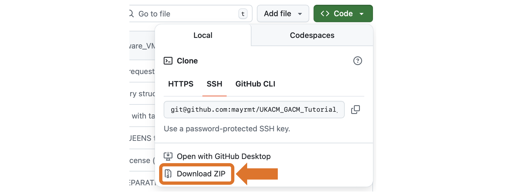

# Preparatory steps for the 4C and QUEENS workshop

This document describes the preparatory steps necessary to participate in the 4C and QUEENS workshop during the UKACM-GACM autumn school 2025.
It is recommended to go through these steps at least one day before the tutorial starts,
so that any issues can be resolved in time.

For the workshop, it is not necessary to install 4C and QUEENS on your own computer. Different software containers with the necessary software already pre-installed are provided (virtual machine appliance, docker container).

The choice between a virtual machine or docker containers is either based on personal preference or might be determined by your available hardware.

- The [Virtual machine](#virtual-machine) only works for `x86_64` architectures.
- Participants with `arm` architecture, e.g. Mac users with Apple Silicon, must resort to the [Docker container](#docker-container).

> We cannot provide support during the workshop on the installation of virtual machine frameworks or docker. Please test it in advance.

This document describes both scenarios:

- [Virtual machine](#virtual-machine)
- [Docker container](#docker-container)

# Virtual machine

## Prerequisites

This VM can be installed on any x86_64 architecture. 
The installation to computers with ARM processors appears to be problematic.

It is beneficial to have a powerful computer with at least 4 physical cores (better 8 or more) and 16 GB RAM, 
and 50 GB free space on the hard disk.

The only software needed here is Oracle VirtualBox (in the following denoted as VB).
The VB version tested is 7.1.
If you don't have it already, please download VB from https://www.virtualbox.org/wiki/Downloads and install it on your computer.

## Installation

The virtual machine appliance is the file [`4C_ukacm_gacm.ova`](https://gigamove.rwth-aachen.de/en/download/bd4f4d2f3fb076e1a717eab7208e0765).
Note that the size of the file is about 12 Gb, so the download should be done with a solid and fast connection.

After receiving the repository locally, 
1. start VB, 
1. import the appliance into VB, 
1. adjust the setting to memory and number of CPUs, which fits to your hardware environment
   (note that the VM should have at least 16 GB RAM and 4 CPUs assigned),
1. start the VM
1. You should not be asked for a username/password. 
   In case you are, click on the username `participant`. If asked for credentials, type `4C.workshop`
2. After the VM has started, please open a terminal window (you'll find the terminal icon on the left icon bar of the main window).
3. Download the repository with the tutorial material by typing the command
   ```
   git clone https://github.com/mayrmt/UKACM_GACM_Tutorial_4C_QUEENS.git
   ```

## Test 4C Executable within VM
1. Navigate to build folder
   ```bash
   cd /home/participant/4C/build/release
   ```
1. Test exectution of one exemplary test file
   ```bash
   ctest -V -R ssi_mono_3D_6hex8_elch_s2i_butlervolmer.4C.yaml-p3
   ```
   if the output looks like:
   ```bash
   100% tests passed, 0 tests failed out of 2
   ```
   &rarr; You're finished!

   in case of failure, you should try the following steps:

1. Reconfigure the code using:
   ```bash
   cmake --fresh --preset=release ../../
   ```
1. Rebuild the 4C executable using:
   ```bash
   ninja full
   ```


# Docker container

## Prerequisites

The following software must be installed on your machine:

- Docker to run 4C and QUEENS (Note: this might require root access)
- ParaView to inspect 4C simulation results (Download [here](https://www.paraview.org/download/).)
- A text editor or integrated development environment (IDE) of your choice to modify input files and scripts.
- An up-to-date web browser (e.g., Chrome, Firefox, Safari).

## Getting the tutorial materials

The tutorial material is provided in a public [GitHub repository](https://github.com/mayrmt/UKACM_GACM_Tutorial_4C_QUEENS).

To clone the repository to your machine, open a terminal and navigate to a directory of your choice, where the data should be stored. Then clone the repository with one of these options:

- If you have `git`, a GitHub account and `ssh` credentials on GitHub:
   ```bash
   git clone git@github.com:mayrmt/UKACM_GACM_Tutorial_4C_QUEENS.git
   ```

- If you have `git`, but no GitHub account:
   ```bash
   git clone https://github.com/mayrmt/UKACM_GACM_Tutorial_4C_QUEENS.git
   ```

- If you do not have `git` on your machine: _Open the [GitHub repository](https://github.com/mayrmt/UKACM_GACM_Tutorial_4C_QUEENS) in your browser. Then click the green `<> Code` button and select "Download ZIP" from the menu._
   
  _Unpack/unzip the directory using the method of your choice._

## Getting and running a docker container:

### 4C docker container

To download and run the pre-compiled docker container for the 4C tutorial, follow the instructions for your operating system:

#### **MacOS / Linux:** 
Open a terminal and navigate into the top level directory of the tutorial repository. Then, start the docker container as follows:

   ```bash
   docker run -i -t -v `pwd`:/home/user/tutorial ghcr.io/4c-multiphysics/4c:latest /bin/bash
   ```

   When you execute this command for the first time, this will download the docker container from the internet. It will then start the container and open a `bash` shell. You will find yourself in the `home/` directory of the user `user` with two directories, `4C` (pre-installed 4C executable) and `tutorial` (mount point of the tutorial files on your machine that you have cloned in the previous step).

#### **Windows:** 
On Windows, there are two options to get access to the docker container. Both options require admin rights for installation, so please make sure to have one of the solutions available when starting the tutorials:

   - **Windows Subsystem for Linux (wsl):** Please refer to [this documentation](https://learn.microsoft.com/en-us/windows/wsl/install) how to setup wsl. Switch to WSL 2 as described in the provided link. Then, follow the instructions for Linux (see above).

   - **Docker Desktop:** You may install it via the Microsoft Store of your system. Start the Docker Desktop app.

      To download and run the provided docker container,

      1. know the `C:\path\to\top\level\directory\tutorial\repo`
      2. Insert this path into the following command and execute it in the Command Prompt:

      ```bash
      docker run -i -t -v "C:\path\to\top\level\directory\tutorial\repo":/home/user/tutorial ghcr.io/4c-multiphysics/4c:latest /bin/bash
      ```

		This mounts the repository folder from your Windows environment into the docker container under `/home/user/tutorial`. You can edit the files in the tutorial repository in your Windows environment, but they will also be available to the docker container. Within the docker container, you will run the simulations in the Linux environment. Output can be written back to the Windows system for further inspection.

### QUEENS docker container

1. Open a terminal in the base directory.

1. Build the docker container using
   
    ```bash
    docker build -f Dockerfile . --tag="ukacm_gacm"
    ```

1. Start the docker via:

    ```bash
    docker run -it -p 8888:8888 ukacm_gacm
    ```

1. In the docker shell run
   
    ```bash
    jupyter notebook --ip 0.0.0.0 --port 8888 --no-browser --allow-root
    ```

    Now, a message will appear:

    ```
        To access the server, open this file in a browser:
            file:///home/user/.local/share/jupyter/runtime/jpserver-20-open.html
        Or copy and paste one of these URLs:
            http://ad553d029988:8888/tree?token=0d21235e0e799e5242e2e08800992e49830c18f379f6d38c
            http://127.0.0.1:8888/tree?token=0d21235e0e799e5242e2e08800992e49830c18f379f6d38c
    ```

1. Open the last link in your web browser.

1. Open a notebook: In the file browser panel, locate the .ipynb file and double-click it. You can find them in the notebook files corresponding subfolder. The notebook will open in a new tab.

1. Work with the notebook:
    * Each notebook consists of cells that can contain either code (Python or other supported languages) or text (Markdown).
    * By clicking on a code cell, you can start writing code in it.
    * To run a cell, select it and press Shift + Enter.
     